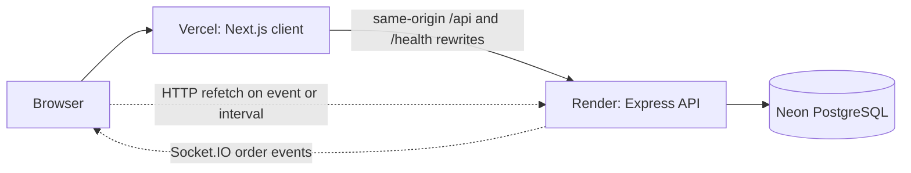

# FoodFlow

Fast-food ordering platform for a single-brand restaurant in Egypt: pizza, burgers, sandwiches, fries and sides, chicken, drinks, desserts, and combo deals.

| Tech | Deployment |
| --- | --- |
| Next.js App Router, TypeScript, Tailwind v4, TanStack Query | Client on Vercel |
| Express, TypeScript, Prisma 7, Zod, Socket.IO | Server on Render |
| PostgreSQL | Database on Neon |

Live demo: https://foodflow-eg.vercel.app

## Overview

FOODFLOW is a full multi-role platform with three sides, not just a customer login:

- Customer experience: landing page with 3D hero, horizontal category showcase, menu with search and category filters, size selection, cart, checkout with order-type selector, order confirmation, order history, live order tracking, account profile, and change password.
- Kitchen display: live order queue in PENDING, CONFIRMED, PREPARING, and READY columns, sorted by preparation deadline, with one-step status advance and live Socket.IO updates plus HTTP polling fallback.
- Manager and admin dashboard: revenue and order analytics, popular items, rush-hour breakdown, menu and category management, availability toggles, staff list and role management, and restaurant open and closed settings.

The manager and kitchen sides are full workspaces behind role checks. A normal visitor only sees the customer side.

## Features

### Customer

- Landing page with 3D hero, category ribbon, horizontal category showcase, menu preview, combo banner, and ordering steps.
- Menu page with search, eight category filters, size variants, spice and combo badges, prep-time labels, and paginated results.
- Cart with size changes, quantity controls, saved cart, floating bag, and bag drawer.
- Checkout with DINE_IN, TAKEAWAY, and DELIVERY types, delivery-address validation, kitchen notes, price recheck, checkout-key idempotency, and cash on receipt payment notice.
- Order confirmation page, order history list, and order detail page with status progress steps and estimated preparation time.
- Account page with profile edit, change password form with show and hide toggles, staff shortcuts, and sign out.
- Dark and light mode toggle persisted in local storage.

### Kitchen

- Live board with ON THE LINE, PREPARING, and READY counters and manual refresh.
- Four status columns: PENDING, CONFIRMED, PREPARING, READY.
- Each ticket shows order number, order type, placed time, minutes left or late state, items with sizes and combo flags, delivery address, and kitchen notes.
- One-click advance: PENDING to CONFIRMED to PREPARING to READY to COMPLETED.
- Socket.IO live refresh on order events with 30-second HTTP refetch fallback.
- Access requires OWNER, MANAGER, or KITCHEN restaurant membership.

### Manager and admin

- Overview tab: total orders, revenue, active queue, average order value, average fulfillment minutes, revenue per day bars, most-wanted items, and rush-hour chart with peak UTC hour.
- Orders tab: active orders sorted by preparation deadline with status pills and totals, plus a link to the kitchen board.
- Menu tab: category create, rename, hide and show, and delete; menu-item create and edit with name, category, description, image URL, sizes and prices, prep time, combo and spicy flags, and availability toggles.
- Staff tab: list members, add by registered email with OWNER, MANAGER, or KITCHEN role, change roles, and remove members. The last OWNER cannot be demoted or removed.
- Settings tab: restaurant name, description, logo URL, and open-for-orders toggle.

### Platform

- Dark and light mode with theme tokens across pages, modals, drawers, toasts, empty states, forms, tables, badges, and charts.
- Branded 3D burger loading screen while the session or server wakes up, with progress estimate, status messages, retry on timeout, and reduced-motion support.
- Real-time order updates over Socket.IO with authenticated handshake, room subscriptions, and HTTP reconciliation.
- Cookie auth with role-based access on client and server.
- Responsive layouts for mobile, tablet, and desktop, keyboard navigation, visible focus states, and reduced-motion fallbacks.

## Roles and permissions

| Route | Customer | KITCHEN | MANAGER | OWNER |
| --- | --- | --- | --- | --- |
| `/`, `/menu`, `/cart` | Yes | Staff workspace notice | Staff workspace notice | Staff workspace notice |
| `/checkout`, `/orders`, `/orders/:publicId` | Own orders only | Staff workspace notice | Staff workspace notice | Staff workspace notice |
| `/account` | Yes | Yes | Yes | Yes |
| `/kitchen` | Denied | Yes | Yes | Yes |
| `/admin` | Denied | Denied | Yes | Yes |

Server rules: prices, permissions, totals, and order state are server authoritative. A public signup creates a customer, never staff. The global ADMIN role alone grants nothing without restaurant membership. Customers can only cancel their own PENDING orders and can only read their own orders.

## Tech stack

| Area | Technology |
| --- | --- |
| Client | Next.js App Router, TypeScript strict, Tailwind v4, TanStack Query, Socket.IO client, GSAP, Three.js, SweetAlert2, Zod |
| Server | Express, TypeScript, Prisma 7, Zod, Socket.IO, scrypt password hashing, JWT in HttpOnly cookies, Helmet, express-rate-limit |
| Database | PostgreSQL on Neon, Prisma migrations, Decimal money fields, idempotency and financial constraints |
| Auth | HttpOnly `foodflow_access` cookie, JWT access tokens, restaurant membership roles |
| Real-time | Socket.IO on `/api/socket.io`, cookie auth, `user:{id}` and `restaurant:{id}:kitchen` rooms, events `order.created`, `order.confirmed`, `order.preparing`, `order.ready`, `order.completed`, `order.cancelled` |
| Animation and 3D | GSAP ScrollTrigger and timelines, Three.js restaurant hero and category gates, CSS loading bar |
| Hosting | Vercel for `client/`, Render for `server/` with `/health/ready` checks, Neon for PostgreSQL |

## Architecture



The browser only talks to the Vercel origin. Next.js rewrites proxy `/api/*`, `/api/socket.io`, and `/health/*` to the Render backend, so auth cookies stay first-party. Checkout, pricing, ownership, and status transitions run in server transactions. Socket.IO emits after a successful commit; clients refetch the authoritative state over HTTP. Preparation deadline equals order creation plus the longest item prep time.

## Project structure

```text
foodflow/
  client/                 Next.js App Router frontend
    app/                  routes: page, menu, cart, checkout, orders, account, kitchen, admin, login, register
    components/           site header and footer, menu explorer, commerce flows, operations boards, loaders
    lib/                  API client, queries, food helpers, checkout helpers, alerts
    public/               local menu and editorial imagery, manifest assets
  server/                 Express API backend
    src/modules/auth/     register, login, profile, password change, access checks
    src/modules/catalog/  public menu, categories, menu items and variants
    src/modules/orders/   customer checkout, history, detail, cancellation
    src/modules/kitchen/  staff queue and status transitions
    src/modules/admin/    overview, revenue, popular items, rush hours, staff
    src/modules/realtime/ Socket.IO auth, rooms, and order events
    prisma/               PostgreSQL schema and migrations
  render.yaml             Render service with /health/ready checks
  Dockerfile              production server build with migrations on start
  docker-compose.yml      local PostgreSQL, API, and web app
```

## Getting started

### Prerequisites

- Node.js 20 or later
- Docker and Docker Compose for the local stack
- A Neon PostgreSQL database for hosted use

### Install

```sh
npm run dev
```

This starts PostgreSQL, the API, and the web app together. Open http://localhost:3000. The API is available at http://localhost:4000.

For standalone development, copy the examples first:

```sh
cp server/.env.example server/.env
cp client/.env.example client/.env.local
```

### Environment variables

| File | Name | Description |
| --- | --- | --- |
| `server/.env` | `DATABASE_URL` | Pooled PostgreSQL URL used by the app |
| `server/.env` | `DIRECT_URL` | Direct PostgreSQL URL used by migrations |
| `server/.env` | `JWT_ACCESS_SECRET` | Random secret with at least 32 characters |
| `server/.env` | `FRONTEND_URL` | Exact frontend origin, no trailing slash |
| `server/.env` | `TRUST_PROXY` | `true` behind Render or another proxy, else `false` |
| `server/.env` | `NODE_ENV` | `development` locally, `production` on Render |
| `server/.env` | `PORT` | API port, `4000` by default |
| `server/.env` | `SEED_OWNER_EMAIL` | Registered email granted OWNER during seeding |
| `server/.env` | `AUTH_LOGIN_WINDOW_MS`, `AUTH_LOGIN_LIMIT` | Login rate-limit window and failed-attempt limit |
| `server/.env` | `AUTH_REGISTER_WINDOW_MS`, `AUTH_REGISTER_LIMIT` | Registration rate-limit window and limit |
| `server/.env` | `API_GENERAL_WINDOW_MS`, `API_GENERAL_LIMIT` | General API rate limit |
| `server/.env` | `API_CHECKOUT_WINDOW_MS`, `API_CHECKOUT_LIMIT` | Checkout rate limit |
| `server/.env` | `API_ADMIN_WINDOW_MS`, `API_ADMIN_LIMIT` | Admin analytics rate limit |
| `client/.env.local` | `NEXT_PUBLIC_API_URL` | Public API origin used at build time |
| `client/.env.local` | `API_INTERNAL_URL` | Optional rewrite override, takes precedence |

Never commit real values. Production secrets belong only in the hosting secret managers.

### Database setup

```sh
docker compose run --rm server npx prisma migrate deploy
docker compose run --rm server npm run db:seed
```

To grant OWNER to an existing account, set `SEED_OWNER_EMAIL` to that registered email before seeding. For a new owner without seeding, use the one-time bootstrap from `server/`:

```sh
BOOTSTRAP_OWNER_EMAIL=owner@example.com npm run owner:bootstrap:prod
```

### Run locally

- Full stack: `npm run dev` from the repo root, stop with `Ctrl+C` or `npm run dev:down`.
- Client only: `npm run dev` from `client/` on port 3000.
- Server only: `npm run dev` from `server/` on port 4000.

### Scripts

| Location | Command | Purpose |
| --- | --- | --- |
| `client/` | `npm run dev` | Start Next.js development server |
| `client/` | `npm run build` | Production build with webpack |
| `client/` | `npm run typecheck` | TypeScript check |
| `client/` | `npm run lint` | ESLint |
| `server/` | `npm run dev` | Start API in watch mode |
| `server/` | `npm run build` | Compile TypeScript |
| `server/` | `npm run typecheck` | TypeScript check |
| `server/` | `npm run lint` | ESLint |
| `server/` | `npm test` | Backend tests, integration suite needs `TEST_DATABASE_URL` |
| `server/` | `npm run db:seed` | Seed restaurant, categories, and menu |
| `server/` | `npm run owner:bootstrap` | One-time owner grant |

## Deployment

- Vercel client: project root `client/`, build command `npm run build`. Set `NEXT_PUBLIC_API_URL` to the Render origin, then redeploy after changing it.
- Render server: builds from the repo root `Dockerfile`, exposes port 4000, runs `prisma migrate deploy` on start, and uses `/health/ready` checks. Set `DATABASE_URL`, `DIRECT_URL`, `JWT_ACCESS_SECRET`, `FRONTEND_URL`, `NODE_ENV=production`, and `TRUST_PROXY=true`.
- Neon database: pooled URL for `DATABASE_URL`, direct URL for `DIRECT_URL`. Run migrations on the API host at startup, then seed once.
- CORS and cookies: only `FRONTEND_URL` is accepted, with credentials. Browser traffic uses same-origin rewrites, so the HttpOnly cookie stays `Secure`, `SameSite=Lax`, and scoped to `/api`.
- Cold start note: the free Render tier can sleep. The app shows the branded burger loading screen while the server wakes up, with retry if it takes too long.

## API overview

- Health: `GET /health`, `GET /health/ready`.
- Auth: `POST /api/auth/register`, `POST /api/auth/login`, `POST /api/auth/logout`, `GET /api/auth/me`, `PATCH /api/auth/me`, `PATCH /api/auth/me/password`, `GET /api/auth/access?restaurantId=`.
- Public catalog: `GET /api/restaurants/public/:slug`, `GET /api/restaurants/public/:slug/menu?category&q&page&limit`.
- Customer orders: `POST /api/orders`, `GET /api/orders?page&limit&status`, `GET /api/orders/:publicId`, `POST /api/orders/:publicId/cancel`.
- Kitchen: `GET /api/restaurants/:id/kitchen/orders`, `PATCH /api/restaurants/:id/kitchen/orders/:publicId/status`.
- Catalog management: category and menu-item CRUD plus availability endpoints.
- Admin: `GET /api/restaurants/:id/admin/overview`, `/revenue`, `/popular-items`, `/rush`, staff list, add, role change, and removal.
- Realtime: Socket.IO at `/api/socket.io` with `kitchen.subscribe` and `kitchen.unsubscribe` acknowledgements.

Responses use `{ success: true, data }` and `{ success: false, error: { code, message, details } }`.

## Testing and linting

```sh
npm run typecheck
npm run lint
npm run build
TEST_DATABASE_URL=postgresql://USER@127.0.0.1:PORT/foodflow_m4_test npm test
```

The backend integration suite rebuilds the disposable `foodflow_m4_test` database schema and must never point at production data.

## Screenshots

- [Placeholder: landing page with 3D hero]
- [Placeholder: menu with category filters]
- [Placeholder: cart and checkout]
- [Placeholder: kitchen live board]
- [Placeholder: admin overview and rush-hour chart]

## Roadmap and known limitations

- Cash ordering is implemented; online payment is not.
- Delivery zones and fee configuration are future work; delivery fee is currently zero.
- Single restaurant and branch model; no multi-branch marketplace.
- JWT has no persistent refresh-token revocation; changing a password keeps the current session and does not revoke other tokens server-side.
- Single-server Socket.IO rooms; horizontal scaling needs a shared adapter and rate-limit store.
- Menu photos include stock and generated media; replace with approved restaurant photography and confirm prices before taking real orders.

## Contributing

Keep changes focused and reviewable, follow TypeScript strict mode, validate with Zod, enforce authorization server-side, and update tests for auth, pricing, ownership, and status transitions.

## License

TODO: no license file exists in this repository yet. Add one before public release.
